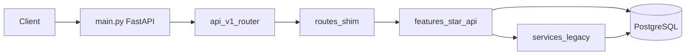
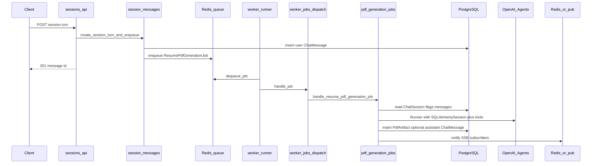
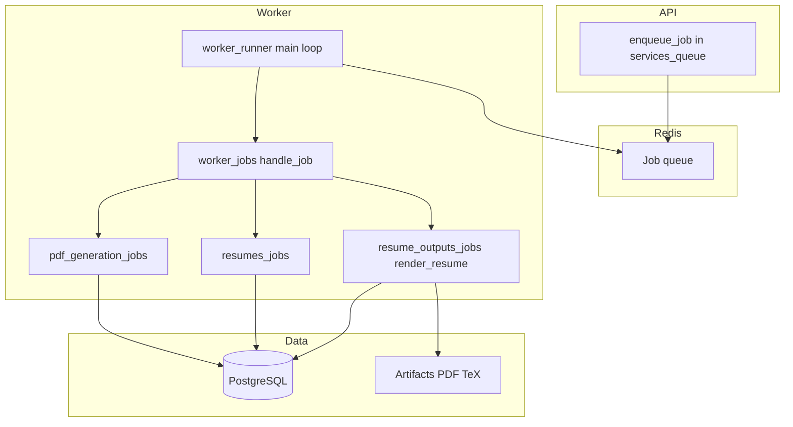

# Backend architecture

This document describes how the FastAPI app, feature modules, shared layers, Redis jobs, and the worker fit together.

## What this backend does (simple)

This service is a **FastAPI** app that:

- Exposes **REST APIs** under `/api/v1` for sessions, resumes, templates, rendered outputs, and job descriptions.
- Uses **PostgreSQL** (via SQLAlchemy) to store data.
- Uses **Redis** as a **job queue**: the API enqueues work; a separate **worker** process dequeues and runs it.
- Calls **OpenAI** for chat, resume parsing, and LaTeX resume “fill” generation where configured.

## Layers (how folders relate)

| Layer | Folder | Role |
|--------|--------|------|
| **HTTP entry** | [`backend/app/main.py`](../app/main.py) | Creates the FastAPI app, CORS, exception handlers, mounts `/api/v1`. |
| **API wiring** | [`backend/app/api/v1/router.py`](../app/api/v1/router.py) | Includes all route modules. |
| **Route shims** | [`backend/app/api/v1/routes/`](../app/api/v1/routes/) | Thin files that re-export `router` from `app.features.*.api` (stable import path for the router). |
| **Feature routers** | [`backend/app/features/*/api.py`](../app/features/) | Endpoints grouped by feature (sessions, resumes, …). |
| **Jobs (async work)** | [`backend/app/features/*/jobs.py`](../app/features/) | Handlers for background jobs (chat, parse resume, render PDF). |
| **Repositories** | [`backend/app/features/*/repo.py`](../app/features/) | Database reads/writes for that feature. |
| **Domain/formatting** | [`backend/app/features/*/service.py`](../app/features/) | Pure or DB-backed helpers (e.g. resume text overview). |
| **Integrations** | [`backend/app/llm/`](../app/llm/) (OpenAI Agents SDK + client wrappers; not the PyPI `openai` package), [`backend/app/features/latex/service.py`](../app/features/latex/service.py) | External systems (OpenAI API, pdflatex). |
| **Legacy/shared services** | [`backend/app/services/`](../app/services/) | Queue, uploads, streaming, session helpers still used by features. |
| **DTOs** | [`backend/app/schemas/`](../app/schemas/) | Pydantic request/response models. |
| **ORM** | [`backend/app/models/`](../app/models/) | SQLAlchemy tables. |
| **Infrastructure** | [`backend/app/core/`](../app/core/), [`backend/app/db/`](../app/db/) | Config, logging, errors, engine/sessions. |
| **Queue contracts** | [`backend/app/queue_jobs/payloads.py`](../app/queue_jobs/payloads.py) | Typed job payloads + JSON serialize/deserialize. |
| **Worker process** | [`backend/app/worker/runner.py`](../app/worker/runner.py), [`backend/app/worker/jobs.py`](../app/worker/jobs.py) | Loop: dequeue → dispatch to feature job handlers. |

**Intended dependency direction** (see also [`backend/app/features/README.md`](../app/features/README.md)):

- `features/*/api.py` → `services/*` or `features/*/repo.py` / `features/*/service.py`
- `features/*/jobs.py` → DB, OpenAI, queue notify, render pipeline
- Avoid **services importing worker** and **worker importing services** in new code; LaTeX compile is centralized in `features/latex/service.py`.

## Features (by folder)

| Feature | HTTP (`features/.../api.py`) | Background jobs | Other |
|---------|------------------------------|-----------------|--------|
| **Sessions** | CRUD chat sessions, list messages, `POST .../turns`, PDF download, DELETE message, SSE stream | — | [`session_services.py`](../app/services/session_services.py), [`session_messages.py`](../app/services/session_messages.py) |
| **PDF agent chat** | (via sessions routes) | [`pdf_generation/jobs.py`](../app/features/pdf_generation/jobs.py) — agent + LaTeX + `pdf_artifacts` | OpenAI Agents SDK + [`SQLAlchemySession`](../app/llm/conversation_session.py), intent, scope |
| **Resumes** | List/upload/download/delete | [`resumes/jobs.py`](../app/features/resumes/jobs.py) — parse text to `parsed_json` | [`resumes/repo.py`](../app/features/resumes/repo.py), [`resumes/service.py`](../app/features/resumes/service.py) for tool context |
| **Job descriptions** | CRUD-style routes under `/sessions/...` and `/job-descriptions` | (ingest also via chat job path) | [`job_descriptions/repo.py`](../app/features/job_descriptions/repo.py), [`job_descriptions/service.py`](../app/features/job_descriptions/service.py) |
| **Resume templates** | CRUD + preview PDF | — | Preview uses [`resume_template_services.py`](../app/services/resume_template_services.py) → LaTeX |
| **Resume outputs** | Create output + download PDF | [`resume_outputs/jobs.py`](../app/features/resume_outputs/jobs.py) → [`render_resume.py`](../app/worker/render_resume.py) | Enqueue from [`resume_output_jobs.py`](../app/services/resume_output_jobs.py) |
| **LaTeX** | Internal compile: [`internal_latex.py`](../app/api/v1/routes/internal_latex.py) | Used by render + preview | [`features/latex/service.py`](../app/features/latex/service.py) |

## Request flow (HTTP)

## Chat turn flow (user message → PDF agent → assistant reply)

Exact notify path: [`chat_reply_notify.py`](../app/services/chat_reply_notify.py) (Redis pub/sub for SSE).

## Job queue flow (all job types)

Job payloads are defined in [`queue_jobs/payloads.py`](../app/queue_jobs/payloads.py):

- `resume_pdf_generation` → [`features/pdf_generation/jobs.py`](../app/features/pdf_generation/jobs.py)
- `parse_resume` → [`features/resumes/jobs.py`](../app/features/resumes/jobs.py)
- `render_resume` → [`features/resume_outputs/jobs.py`](../app/features/resume_outputs/jobs.py) → [`worker/render_resume.py`](../app/worker/render_resume.py)

## OpenAI and resume context

- Chat agent: [`llm/resume_chat_agent.py`](../app/llm/resume_chat_agent.py)
- Resume/JD text for tools: loaded via [`features/resumes/repo.py`](../app/features/resumes/repo.py) and [`features/job_descriptions/service.py`](../app/features/job_descriptions/service.py) (prefer not adding new DB access under `llm/`).

## Operational endpoints

- **Health**: `GET /healthz` in [`main.py`](../app/main.py)
- **API base**: `/api/v1` (see router include list in [`api/v1/router.py`](../app/api/v1/router.py))
