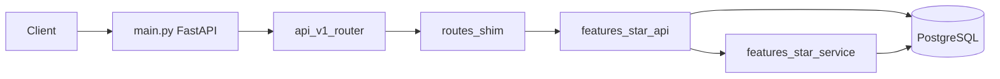

# Backend architecture

This document describes how the FastAPI app, feature modules, Redis jobs, the worker, and OpenAI/LaTeX integrations fit together.

## What this backend does (simple)

This service is a **FastAPI** app that:

- Exposes **REST APIs** under `/api/v1` for **sessions**, **resumes**, **resume templates**, **resume outputs**, **PDF artifacts** (file download), **job descriptions**, and an **internal LaTeX compile** route.
- Persists data in **PostgreSQL** via SQLAlchemy (async).
- Uses **Redis** as a **job list** (queue): the API enqueues typed jobs; a separate **worker** process dequeues and runs handlers in `features/*/jobs.py` (plus `worker/render_resume.py` for the render automation loop).
- Uses **Redis pub/sub** so the worker can notify the API when an assistant message is ready (SSE to the browser).
- Calls **OpenAI** (Agents SDK and related helpers under [`app/llm/`](../app/llm/)) for chat, resume text → structured JSON, template assistance, and automated resume-output filling; uses **pdflatex** via [`features/latex/service.py`](../app/features/latex/service.py).

## Layers (how folders relate)

| Layer | Folder | Role |
|--------|--------|------|
| **HTTP entry** | [`app/main.py`](../app/main.py) | FastAPI app, CORS, exception handlers, `/healthz`, mounts `/api/v1`. |
| **API wiring** | [`app/api/v1/router.py`](../app/api/v1/router.py) | Registers routers: sessions, resumes, resume_templates, resume_outputs, pdf_artifacts, job_descriptions, internal LaTeX. |
| **Route shims** | [`app/api/v1/routes/`](../app/api/v1/routes/) | Thin re-exports of `router` from `app.features.*.api` (stable import paths). |
| **Feature routers** | [`app/features/*/api.py`](../app/features/) | HTTP handlers per domain. |
| **Jobs (async work)** | [`app/features/*/jobs.py`](../app/features/) | `resume_pdf_generation`, `parse_resume`, `render_resume` handlers (worker dispatches here). |
| **Data access** | Per-feature | **Sessions**, **resumes**, and **job_descriptions** each have [`sessions/repositories.py`](../app/features/sessions/repositories.py), [`resumes/repositories.py`](../app/features/resumes/repositories.py), [`job_descriptions/repositories.py`](../app/features/job_descriptions/repositories.py). **Resume templates** and **resume outputs** have no separate repository module—queries live in `service.py` / `jobs.py` as appropriate. |
| **Domain / orchestration** | [`app/features/*/service.py`](../app/features/) | Business rules, pagination helpers, enqueue calls, LaTeX preview, etc. |
| **PDF artifact files** | [`app/features/pdf_generation/pdf_artifacts.py`](../app/features/pdf_generation/pdf_artifacts.py) | Shared helpers to write rows and files; HTTP download lives in [`features/pdf_artifacts/api.py`](../app/features/pdf_artifacts/api.py). |
| **Integrations** | [`app/llm/`](../app/llm/), [`app/features/latex/service.py`](../app/features/latex/service.py) | OpenAI Agents SDK usage (package `openai-agents`; distinct from PyPI `openai` usage patterns in `_sdk.py`), LaTeX compile. |
| **Job queue (Redis list)** | [`app/features/job_queue/redis.py`](../app/features/job_queue/redis.py) | `enqueue_job` / `dequeue_job`; list key from `settings.redis.queue_key` (default `queue:agent-jobs`). |
| **DTOs** | [`app/schemas/`](../app/schemas/) | Pydantic request/response models. |
| **ORM** | [`app/models/`](../app/models/) | SQLAlchemy models. |
| **Infrastructure** | [`app/core/`](../app/core/), [`app/db/`](../app/db/) | Settings, logging, errors, engine/session factory. |
| **Queue contracts** | [`app/queue_jobs/payloads.py`](../app/queue_jobs/payloads.py) | Typed job payloads + JSON serialize/deserialize. |
| **Worker process** | [`app/worker/runner.py`](../app/worker/runner.py), [`app/worker/jobs.py`](../app/worker/jobs.py) | Main loop: dequeue → `handle_job` → feature job modules. |

**Intended dependency direction** (see also [`app/features/README.md`](../app/features/README.md)):

- `features/*/api.py` → `service.py`, `repositories.py`, or siblings (e.g. `sessions/chat_messages.py`).
- `features/*/jobs.py` → DB session, OpenAI, `enqueue`/`publish` helpers, LaTeX client—not the reverse.
- Avoid **feature routers importing the worker**; avoid the **worker importing FastAPI route modules**. LaTeX HTTP compile stays in `features/latex/service.py`.

## Features (by folder)

| Feature | HTTP | Background jobs | Other |
|---------|------|------------------|--------|
| **Sessions** | CRUD sessions, messages, `POST .../messages`, artifact file download via pdf_artifacts routes, DELETE message, SSE | — | [`sessions/service.py`](../app/features/sessions/service.py), [`sessions/chat_messages.py`](../app/features/sessions/chat_messages.py), [`sessions/assistant_sse.py`](../app/features/sessions/assistant_sse.py), [`sessions/repositories.py`](../app/features/sessions/repositories.py) |
| **PDF agent chat** | (via sessions) | [`pdf_generation/jobs.py`](../app/features/pdf_generation/jobs.py) | Agents SDK + [`llm/sessions.py`](../app/llm/sessions.py) (`SQLAlchemySession`), [`llm/resume_chat_agent.py`](../app/llm/resume_chat_agent.py), notify [`chat_reply_redis.py`](../app/features/sessions/chat_reply_redis.py) |
| **Resumes** | List/upload/download/delete | [`resumes/jobs.py`](../app/features/resumes/jobs.py) → `parsed_json` | [`resumes/repositories.py`](../app/features/resumes/repositories.py), [`resumes/service.py`](../app/features/resumes/service.py), [`resumes/uploads.py`](../app/features/resumes/uploads.py) |
| **Job descriptions** | `GET/POST /job-descriptions`, `GET /job-descriptions/{id}`, session-scoped create/list/activate under `/sessions/{id}/job-descriptions` | — (library + session `job_description_id`) | [`job_descriptions/repositories.py`](../app/features/job_descriptions/repositories.py), [`job_descriptions/service.py`](../app/features/job_descriptions/service.py) |
| **Resume templates** | CRUD + preview PDF | — | [`resume_templates/service.py`](../app/features/resume_templates/service.py), [`resume_templates/latex_preview.py`](../app/features/resume_templates/latex_preview.py) |
| **Resume outputs** | Create row + download when ready | [`resume_outputs/jobs.py`](../app/features/resume_outputs/jobs.py) → [`worker/render_resume.py`](../app/worker/render_resume.py) | [`resume_outputs/service.py`](../app/features/resume_outputs/service.py). `RenderResumeJob` includes optional **`session_id`** (nullable for outputs not tied to a chat). |
| **PDF artifacts** | Download file for an artifact id | — | Row/file helpers in pdf_generation; routes in [`pdf_artifacts/api.py`](../app/features/pdf_artifacts/api.py) |
| **LaTeX** | `POST .../internal/compile` ([`internal_latex` route](../app/api/v1/routes/internal_latex.py)) | Used by worker render path + template preview | [`features/latex/service.py`](../app/features/latex/service.py) |

## Request flow (HTTP)

## Chat turn flow (user message → PDF agent → assistant reply)

Exact notify path: [`chat_reply_redis.py`](../app/features/sessions/chat_reply_redis.py) (Redis pub/sub channel keyed by `user_message_id`).

## Job queue flow (all job types)

Job payloads: [`queue_jobs/payloads.py`](../app/queue_jobs/payloads.py).

| `type` field | Handler |
|--------------|---------|
| `resume_pdf_generation` | [`features/pdf_generation/jobs.py`](../app/features/pdf_generation/jobs.py) |
| `parse_resume` | [`features/resumes/jobs.py`](../app/features/resumes/jobs.py) |
| `render_resume` | [`features/resume_outputs/jobs.py`](../app/features/resume_outputs/jobs.py) (delegates to [`worker/render_resume.py`](../app/worker/render_resume.py) for the automation + LaTeX loop) |

## OpenAI and context (where to look)

| Concern | Module |
|---------|--------|
| Named agents (instructions wiring) | [`llm/agents.py`](../app/llm/agents.py) |
| Chat PDF turn (runner, tools, hooks) | [`llm/resume_chat_agent.py`](../app/llm/resume_chat_agent.py) |
| Resume upload → structured profile JSON | [`llm/resume_extract.py`](../app/llm/resume_extract.py) |
| Template sample / LaTeX fix one-shots | Used from [`features/resume_templates/service.py`](../app/features/resume_templates/service.py) via agents in `agents.py` |
| Resume output automation (fill + compile) | [`llm/render_resume_agent.py`](../app/llm/render_resume_agent.py) |
| Agents session memory factory | [`llm/sessions.py`](../app/llm/sessions.py) |
| Tool implementations (search, compile, JD fetch, …) | [`llm/tools.py`](../app/llm/tools.py) |

Resume and job-description text for tools should be loaded through **feature** `repositories.py` / `service.py`, not new raw SQL inside `llm/`.

## Operational endpoints

- **Health**: `GET /healthz` in [`main.py`](../app/main.py)
- **API**: `/api/v1` — router modules listed in [`api/v1/router.py`](../app/api/v1/router.py); interactive schema at `/docs` when the server runs.
