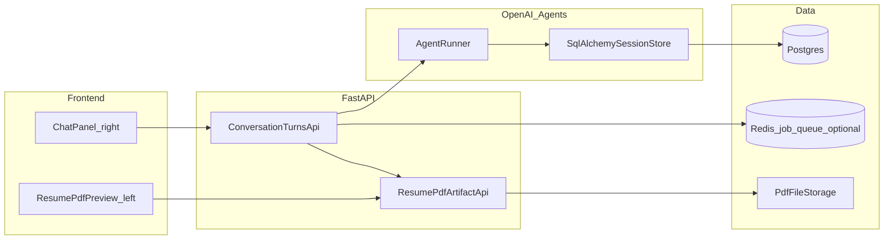

# NEXT REFACTOR (temporary) — PDF-first agent chat

**Status:** planning handoff only. **Delete this document when the refactor is complete.**

## Product vision

Build a **chat-shaped** experience where the **primary output is a resume PDF**, not a long text reply.

- **Layout:** **Left:** live preview of the **latest generated resume PDF**. **Right:** chat (messages + composer).
- **Each user turn** should result in a **new PDF** (or a clear in-chat error if compile fails), reflecting feedback and context from the conversation.
- **New capability:** an **agent helps generate or refine the LaTeX template** when needed (auto-template / template assistant), not only fill a fixed template.

We are **not in production** yet: **allowed to wipe DB data**, **replace Alembic history**, and **delete legacy code** like a near-greenfield rebuild.

## Code naming (required)

Use **readable identifiers** everywhere—**no shortcut names** that hide meaning.

- **Python:** prefer full words in `snake_case` (e.g. `job_description_id`, `resume_template_id`, `assistant_message`, `pdf_artifact_path`). Avoid cryptic abbreviations like `jd`, `tpl`, `msg` (except maybe trivial loop indices like `index` / `row` where scope is tiny).
- **TypeScript / React:** prefer clear `camelCase` or `PascalCase` component names (e.g. `ResumePdfPreview`, `ChatMessageList`, `jobDescriptionId`).
- **API JSON fields:** spell out concepts (`job_description_id`, not `jd_id`).
- **Database columns / Alembic:** same rule as Python—future readers should not need a glossary.

Enforce via **code review** and **linting** where possible (e.g. Ruff naming rules or team convention doc).

## Non-goals (for v1 of this refactor)

- Perfect multi-tenant auth (can stay single-user / no auth until later).
- Keeping backward compatibility with every old API path.

## Backend architecture (target)

### Core loop

1. Client sends a **chat message** with **run context**: `session_id`, `template_id`, `resume_id`, `job_description_id` (nullable).
2. Server loads **resume** + **job description** (if present) + **template** from DB.
3. Server runs **OpenAI Agents SDK** with a typed **run context** (for example the SDK’s `RunContextWrapper` around a **named app type** such as `ResumeAgentContext`) carrying those IDs plus any ephemeral state—use a **readable dataclass or TypedDict** for domain fields, not anonymous dicts.
4. Agent (and tools) produce or update **LaTeX** (or structured fill data → render pipeline).
5. Server runs **pdflatex** (existing pattern: [`backend/app/features/latex/service.py`](../app/features/latex/service.py)) and stores **PDF bytes or artifact path**.
6. Response to client includes **metadata** (message ids, PDF URL or signed URL, status, errors).

### Session memory (OpenAI Agents + SQLAlchemy)

**Goal:** Persist **short-term agent session / conversation items** in **Postgres** via SQLAlchemy so the model sees a coherent thread per app session.

- Evaluate dependency: `openai-agents[sqlalchemy]` (or the current documented extra for SQLAlchemy-backed sessions—confirm exact package extra name and import paths in PyPI / Agents SDK release notes before locking versions).
- **Official cookbook entry point** (session memory patterns, trimming, summarization): [Context Engineering - Short-Term Memory Management with Sessions from OpenAI Agents SDK](https://developers.openai.com/cookbook/examples/agents_sdk/session_memory) — use OpenAI docs MCP (`search_openai_docs` → `fetch_openai_doc`) while implementing to match the **current** API.

**User-controlled context trimming**

- Expose **DELETE message** (or “remove from agent session”) so users can **drop old turns** from the persisted session store to save tokens.
- Decide policy: delete only **UI messages**, vs delete **both** UI row and **backing agent session items** (preferred for true context reduction).

### Data model (sketch — replace current schema)

Design tables for at least:

- **`chat_session`** (app session): links to optional `resume_id`, `job_description_id`, `template_id`, timestamps.
- **`chat_message`**: role, user-visible text, ordering, `pdf_artifact_id` nullable (each assistant turn that produced PDF).
- **`pdf_artifact`** (or file metadata): storage path or object key, `mime_type`, `sha256`, `created_at`, `session_id`, `message_id`.
- **`resume_template`**: name, `latex_source`, optional `schema_json` if you still use structured fill.
- **`resume`**, **`job_description`**: keep if still needed for source material.

**Migration strategy**

- Remove old Alembic versions under [`backend/alembic/versions/`](../alembic/versions/) after backup.
- Add a **new `0001_...py`** baseline reflecting the new schema.
- **Wipe** Postgres volume / run `DROP SCHEMA` in dev.
- **Flush** Redis keys for old queues if queue shape changes.

## API contract (target)

### Send message

`POST /api/v1/...` (choose resource naming, e.g. `/sessions/{id}/turns`):

**Body (example)**

```json
{
  "content": "Make the summary shorter and mention Kubernetes.",
  "template_id": "uuid",
  "resume_id": "uuid",
  "job_description_id": null
}
```

**Semantics**

- `session_id` from path.
- Server passes `template_id`, `resume_id`, `job_description_id` into **agent run context** (along with DB-loaded blobs as needed).

### List messages

- Returns ordered messages; each assistant message that produced PDF includes **`pdf_download_url`** or **`pdf_artifact_id`** (readable name; avoid vague `artifact_id` in public JSON unless you namespace it clearly).

### Delete message

- `DELETE /api/v1/.../messages/{message_id}`
- Removes from DB **and** removes associated rows from **SQLAlchemy-backed agent session** if applicable.

## Worker / async

Today, heavy work uses Redis + worker ([`backend/app/worker/runner.py`](../app/worker/runner.py)). For PDF generation you can:

- **Option A (simpler):** synchronous in API with long timeout + progress via SSE/WebSocket (harder ops).
- **Option B (recommended):** enqueue **`ResumePdfGenerationJob`** (or similarly explicit name); worker runs agent + LaTeX; client polls or subscribes for “PDF ready” (reuse Redis pub/sub pattern from current SSE notify if useful).

Pick one explicitly in implementation; default recommendation: **Option B** for stability.

## Frontend (target)

- **Split pane:** use **shadcn/ui** patterns (e.g. `ResizablePanelGroup`, scroll areas, sheet/drawer for mobile). Use **shadcn MCP** in the editor to scaffold components.
- **PDF panel:** `iframe` pointing at PDF URL, or `react-pdf` if you need in-canvas controls.
- **Chat panel:** existing message list + composer; after each send, refresh PDF when new **`pdf_artifact_id`** arrives.

## Legacy code removal (explicit)

Safe to delete or rewrite (non-exhaustive — audit during implementation):

- Old **chat-only** job pipeline if replaced by PDF-turn pipeline: [`backend/app/features/messages/jobs.py`](../app/features/messages/jobs.py), Redis job types in [`backend/app/queue_jobs/payloads.py`](../app/queue_jobs/payloads.py), [`backend/app/services/chat_reply_stream.py`](../app/services/chat_reply_stream.py) if SSE model changes.
- Old **orchestrator / intent / scope** layers if the new agent replaces that routing.
- **Route shims** under [`backend/app/api/v1/routes/`](../app/api/v1/routes/) if you collapse routing.

Keep **LaTeX compile** centralized; extend rather than fork.

## Implementation checklist (for the next agent)

1. Confirm `openai-agents` version + **SQLAlchemy session extra** and document exact install line in [`backend/pyproject.toml`](../pyproject.toml).
2. Propose final **ERD** and Alembic `0001`.
3. Implement a **readable domain context type** (e.g. `ResumeAgentContext`) and wire it into `Runner.run` (or current SDK entrypoint per docs).
4. Implement **PDF artifact** write + **download** route.
5. Implement **delete message** + session trim semantics.
6. Frontend split layout + wire API.
7. Pass a **naming review**: no new abbreviations in public APIs, DB columns, or cross-module types.
8. Remove **this file** (`NEXT_REFACTOR_PDF_AGENT.md`) once merged and stable, and remove any links to it from the repo root `README.md` and [`ARCHITECTURE.md`](ARCHITECTURE.md).

## References for implementers

- OpenAI: Agents SDK session memory cookbook — https://developers.openai.com/cookbook/examples/agents_sdk/session_memory (use OpenAI docs MCP to fetch current sections).
- OpenAI: search “Agents SDK”, “Runner”, “RunContextWrapper”, “session” before coding.
- UI: shadcn MCP for resizable layout + chat list components.

## Target system diagram


